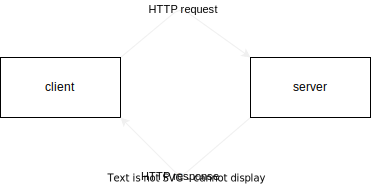
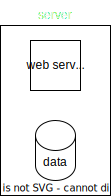
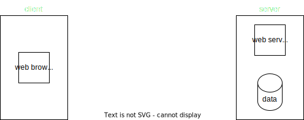
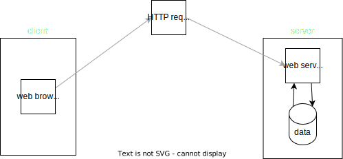
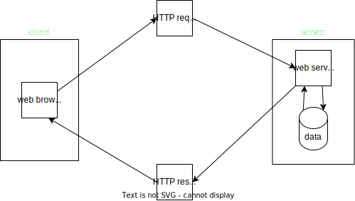

# mfl4-http-pzn

---

## HTTP Introduction
- HTTP singkatan dari Hypertext Transfer Protocol
- HTTP merupakan protokol untuk melakukan transmisi hypermedia document, seperti HTML, JavaScript, CSS, Image, Audio, Video dan lain-lain
- HTTP awalnya di desain untuk komunikasi antara Web Browser dan Web Server, namun saat ini sering juga digunakan untuk kebutuhan lain

### Client Server
- HTTP mengikuti arsitektur client dan server
- Client mengirimkan HTTP Request untuk meminta atau mengirim informasi ke server
- Dan server membalasnya dengan HTTP Response dari HTTP Request yang diterima

### Diagram Client Server

### Plain Language and Human Readable
HTTP didesain menggunakan bahasa yang mudah dimengerti oleh bahasa manusia, seperti :
- GET
- POST
- PUT
- DELETE
- HEAD
- OPTION

### Stateless
- HTTP merupakan protokol yang stateless
- Artinya tiap HTTP Request merupakan request yang independen, tidak ada keterkaitan atau hubungan dengan HTTP Request sebelum atau setelah nya
- Hal ini dilakukan agar HTTP Request tidak harus dilakukan dalam sequence, sehingga client bisa melakukan HTTP Request secara bebas tanpa ada aturan harus dimulai dari mana

### Session
- Jika HTTP merupakan protokol yang stateless, bagaimana dengan session? Misal client harus login terlebih dahulu sebelum berinteraksi?
- Untuk menangani permasalahan seperti ini, HTTP memiliki fitur yang bernama HTTP Cookie
- HTTP Cookie memaksa client menyimpan informasi yang diberikan oleh server

---

## HTTP Version
- Spesifikasi HTTP selalu diperbaharui
- Saat ini, kebanyakan web berjalan di HTTP/1.1 atau HTTP2
- HTTP2 mulai hadir sekitar tahun 2015, dan saat ini sudah banyak diadopsi oleh semua Web di Dunia

### HTTP/1.1 vs HTTP/2
- Saat ini HTTP/1.1 merupakan fallback protocol, dimana Web Browser secara default akan melakukan request menggunakan HTTP/2, jika web server tidak mendukung, maka web browser akan melakukan fallback ke protocol HTTP/1.1
- Secara garis besar, spesifikasi HTTP/2 sama dengan HTTP/1.1, yang membedakan adalah pada HTTP/2, HTTP Request yang dikirim dalam bentuk teks, secara otomatis menjadi binary, sehingga lebih cepat dibandingkan HTTP/1.1
- Selain itu di HTTP/2, menggunakan algoritma kompresi untuk memperkecil request dan mendukung multiplexing, sehingga bisa mengirim beberapa request dalam satu connection yang sama
- Dari sisi pembuatan aplikasi, tidak ada perbedaan, semua ini biasanya sudah diurus secara otomatis oleh Web Server yang kita gunakan

### HTTPS
- Secara default, HTTP tidaklah aman
- HTTPS merupakan HTTP dengan enkripsi
- Perbedaan HTTP dan HTTPS adalah, pada HTTPS menggunakan SSL (Secure Sockets Layer) untuk melakukan enkripsi HTTP Request dan HTTP Response
- Hasilnya HTTPS jauh lebih aman dibanding dengan HTTP biasa
- Web yang menggunakan HTTPS akan menggunakan https:// pada url nya, dan yang hanya menggunakan HTTP tanpa enkripsi, akan menggunakan http://

---

## HTTP Terminology
- Saat kita belajar HTTP, ada banyak sekali menggunakan terminologi, istilah atau teknologi
- Dan kita perlu mengerti tentang hal tersebut

### Web Browser
- Merupakan aplikasi yang digunakan untuk mengakses Web menggunakan protokol HTTP
- Contohnya aplikasi Google Chrome, Firefox, Opera, Safari, dan lain-lain

### TCP
- TCP singkatan dari Transmission Control Protocol, adalah salah satu protokol dalam jaringan komputer yang biasa digunakan oleh web, email, FTP atau lainnya
- Jika kita menggunakan jaringan internet, kemungkinan besar kita akan menggunakan protocol TCP untuk melakukan koneksi jaringan nya

### IP
- IP singkatan dari Internet Protocol
- IP digunakan sebagai identitas komputer di jaringan
- Setiap komputer baik itu client dan server akan memiliki IP
- Untuk mengecek IP jaringan kita di internet, contohnya kita bisa mengakses web https://whatismyipaddress.com/

### URL
- URL singkatan dari Uniform Resource Locator
- URL merupakan alamat dari sebuah resource di Web

### DNS
- DNS singkatan dari Domain Name Server
- DNS merupakan tempat yang berisi data katalog pemetaan antara nama domain di URL menuju lokasi IP komputer
- Saat Web Browser mengakses sebuah domain di web, sebenarnya prosesnya akan bertanya ke DNS untuk mendapatkan IP, lalu Web Browser akan melakukan request ke IP tersebut
- Untuk mengecek IP sebuah domain, kita bisa gunakan website https://www.whatismyip.com/dns-lookup/

### Web Server
- Web Server merupakan aplikasi yang berjalan di jaringan Internet yang bertugas sebagai server
- Web Server berisi informasi dan data yang biasa diakses oleh client
- Web Server akan menerima request dari client, dan membalas request tersebut berupa informasi yang diminta oleh client

---

## HTTP Flow
-  Bagaimana alur kerja HTTP?
-  Dalam HTTP, biasanya terdapat dua pihak yang terlibat, yaitu Client dan Server
-  Client akan mengirimkan Request
-  dan Server akan menerima Request dan membalas dengan Response

### Server
- Server merupakan sebuah komputer, dimana semua informasi disimpan pada komputer tersebut
- Komputer server biasanya menjalankan aplikasi Web Server agar bisa menerima protocol HTTP

### Diagram HTTP Flow

### Client
- Client merupakan komputer yang bertugas
- mengirim HTTP Request ke komputer Server Untuk mengirim request HTTP, biasanya client akan menggunakan aplikasi Web Browser
- Client dan Server harus terkoneksi dalam jaringan yang sama, agar bisa berkomunikasi
- Misal saja, client dan server terhubung dalam jaringan internet

### Diagram HTTP Flow

### Request
- Client akan mengirim request ke Server dalam bentuk HTTP Request
- HTTP Request berisikan informasi seperti lokasi resource, data yang dikirim jika ada, dan lain-lain
- HTTP Request akan diterima oleh Server
- Selanjutnya Server akan memproses request yang diminta oleh Client tersebut

### Diagram HTTP Flow

### Response
- Setelah Server memproses HTTP Request yang dikirim oleh Client
- Server akan membahas dengan HTTP Response
- HTTP Response biasanya berisikan data yang diminta oleh Client dalam HTTP Request

### Diagram HTTP Flow

---
