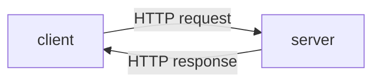

# mfl4-http-pzn

---

## HTTP

### HTTP Introduction
- HTTP singkatan dari Hypertext Transfer Protocol
- HTTP merupakan protokol untuk melakukan transmisi hypermedia document, seperti HTML, JavaScript, CSS, Image, Audio, Video dan lain-lain
- HTTP awalnya di desain untuk komunikasi antara Web Browser dan Web Server, namun saat ini sering juga digunakan untuk kebutuhan lain

### Client Server
- HTTP mengikuti arsitektur client dan server
- Client mengirimkan HTTP Request untuk meminta atau mengirim informasi ke server
- Dan server membalasnya dengan HTTP Response dari HTTP Request yang diterima

### Diagram Client Server

### Plain Language and Human Readable
HTTP didesain menggunakan bahasa yang mudah dimengerti oleh bahasa manusia, seperti :
- GET
- POST
- PUT
- DELETE
- HEAD
- OPTION

### Stateless
- HTTP merupakan protokol yang stateless
- Artinya tiap HTTP Request merupakan request yang independen, tidak ada keterkaitan atau hubungan dengan HTTP Request sebelum atau setelah nya
- Hal ini dilakukan agar HTTP Request tidak harus dilakukan dalam sequence, sehingga client bisa melakukan HTTP Request secara bebas tanpa ada aturan harus dimulai dari mana

### Session
- Jika HTTP merupakan protokol yang stateless, bagaimana dengan session? Misal client harus login terlebih dahulu sebelum berinteraksi?
- Untuk menangani permasalahan seperti ini, HTTP memiliki fitur yang bernama HTTP Cookie
- HTTP Cookie memaksa client menyimpan informasi yang diberikan oleh server

---